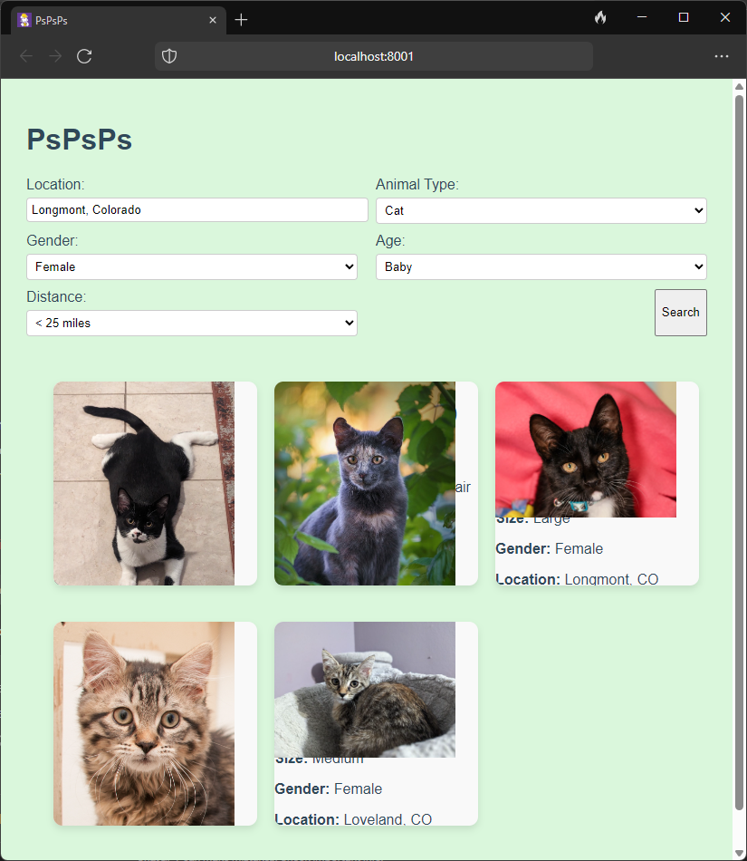
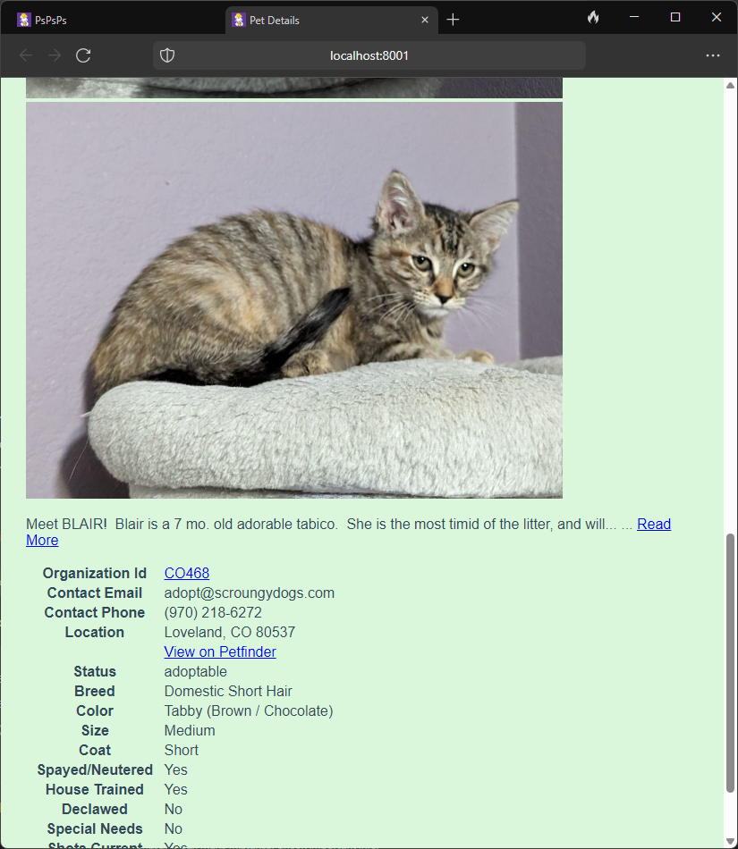

# pspsps
Application using the Petfinder API to browse cats and dogs (without the advertisements)





## How to Use Locally

1. Clone this repository
2. Create a `.env` file in the root directory with your Petfinder API credentials:
   ```
   PETFINDER_API_KEY=your_api_key
   PETFINDER_API_SECRET=your_api_secret
   ```
3. Run the start script to install dependencies and start the Netlify development server:
   ```
   ./start-dev.sh
   ```
   
   This will:
   - Install the required dependencies
   - Start the Netlify Dev server on port 8888
   - Set up the serverless function for API proxying
   
   Alternatively, you can run these steps manually:
   ```
   npm install
   cd netlify/functions && npm install && cd ../..
   npx netlify dev
   ```

## Debugging

If you encounter issues with the API proxy:

1. Test the API connection directly:
   ```
   node debug-api.js
   ```
   This will verify if the Petfinder API is working correctly with your credentials.

2. Test the serverless function:
   ```
   node test-serverless.js
   ```
   This tests the serverless function directly without going through Netlify Dev.

3. Common issues:
   - Make sure your API requests go to `/api/v2/...` not just `/v2/...`
   - Check browser console for detailed error messages
   - Verify your .env file has the correct API credentials

## Deployment to Netlify

1. Push your repository to GitHub
2. Log in to Netlify and create a new site from your GitHub repository
3. Add the following environment variables in the Netlify dashboard:
   - `PETFINDER_API_KEY`: Your Petfinder API key
   - `PETFINDER_API_SECRET`: Your Petfinder API secret
4. Deploy your site

Netlify will automatically detect the `netlify.toml` configuration and deploy the site with the serverless function.